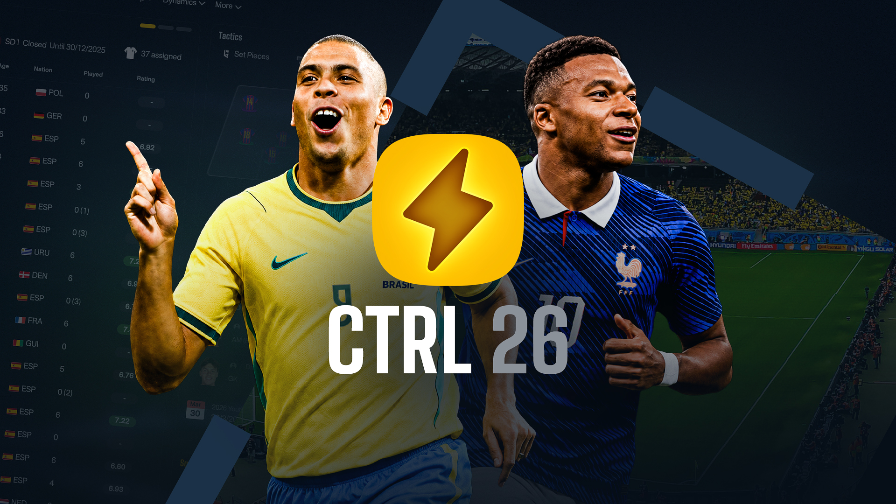

  

# CTRL 26

### ⚠️ Usage guidelines

This repository is shared so people can build personal tweaks of CTRL and learn how the skin is put together. You are welcome to explore the files, study how things work, and make changes for your own game.

Please do not make small tweaks to CTRL and release the result as your own skin. If you want to publish something publicly, it should be meaningfully your own work rather than a lightly edited version of this project.

### 📦 Install via FM Skin Builder

Use **FM Skin Builder** to download CTRL, apply it to your game, and keep backups, all without juggling files by hand. When a new release is available, you’re notified in the app so you can update and apply it to your game from the same place. Download the skin in the skins gallery, or grab it directly from the website: **[CTRL 26 on FM Skin Builder](https://fmskinbuilder.com/skins/ctrl-26)**.

### 🚀 Build source with FM Skin Builder

**Install FM Skin Builder first** - Get the latest beta from **[fmskinbuilder.com/downloads](https://fmskinbuilder.com/downloads)**, this is required before you can build and apply CTRL.

1. Open the `CTRL` folder in **FM Skin Builder**.
2. Click **Build** in the toolbar, or use **Build > Output > Build**.
3. Wait for the build steps to complete; output is written to `packages/` as modified `.bundle` files.
4. After building, click **Apply to Game** (or **Build > Game Status**) to copy bundles into FM’s directory.

> First build may take a few minutes while bundles are scanned; later builds use cache and are typically faster. See [Installation](https://fmskinbuilder.com/docs/getting-started/installation), [Full Build](https://fmskinbuilder.com/docs/building/full-build) and [Applying to Game](https://fmskinbuilder.com/docs/building/applying-to-game) for more information.

Note: Some changes must be made manually in UABEA (e.g. message indicators, gradients, dugout tiles). See `_uabea/UABEA-Notes.md` for details on Windows changes.

<!-- ### 📦 Install from bundles

If you downloaded a **Bundles (WIN)** or **Bundles (MAC)** release:

1. **Extract** the bundle files into your game installation folder (replace the existing files when prompted).
2. **Windows (Steam):** Default folder is
   `C:\Program Files (x86)\Steam\steamapps\common\Football Manager 26\fm_Data\StreamingAssets\aa\StandaloneWindows64`
3. **macOS:** Right-click the **Football Manager** app → **Show Package Contents**, then navigate to the bundles folder using a similar path structure as above (`Content` → `Resources` → `Data` → `StreamingAssets` → `aa` → `StandaloneOSX`).

### 🔧 Bugs & improvements

Known bugs, planned changes and improvement ideas are tracked on the public **[Trello board](https://trello.com/b/5BB8Gpe3/ctrl-26)**. You can check it for current issues, see what’s in the pipeline, or get an idea of what might be fixed in future updates. -->

### 💖 Support FM Skin Builder

If you’d like to support ongoing development of **FM Skin Builder** and help cover hosting, tooling and research time, you can do so via **[Ko‑fi](https://ko-fi.com/lotsgon)**. The builder will remain free to use; contributions simply help keep the project online, stable and improving over time.

### 🙏 Thanks to...

**lotsgon**, **Darkside**, **(sic)**, **MrTini23** and everyone else working to improve the FM skinning experience.
